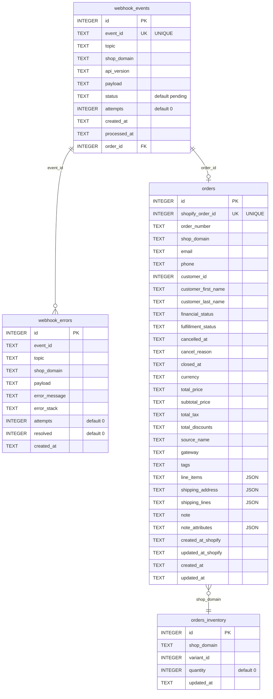

## Shopify Webhook 資料流程
1. 接收 webhook — POST /webhooks/shopify 擷取 raw 資料封包確認 Shopify HMAC 加密
2. 驗證 Shopfiy HMAC-SHA256 與環境參數 SHOPIFY_WEBHOOK_SECRET，使用 timingSafeEqual。商店網域必須與 config 相同
3. Event 在進入 queue 之前，先以 INSERT OR IGNORE（依 event_id）寫入 SQLite webhook_events table。即使 queue 當機，也能保證資料不會遺失。
p.s. 這邊我有考慮更改為先將 webhook event_id 與 raw payload 存入 queue，馬上回傳 status == 200，之後再安排 job worker 執行將 payload 資料寫入對應資料庫欄位，確保資料庫寫入動作不會 block 回傳 status 的動作。但最後考慮 payload 大小可能對 job queue 會過於龐大因此作罷。解決 payload 大小的方式可以事先設定 Shopify webhook includeFields 參數。

4. 以 jobId（webhook:{eventId}）建立 BullMQ 任務。已處於執行中或已完成的重複任務會被略過，而延遲中或等待中的則會被新任務取代。任務依據 X-Shopify-Triggered-At 設定延遲與排序，確保依時間先後處理。
5. Worker 處理 webhook_events table 中記錄，依照 topic 分類:
  - orders/created — 在一筆 SQLite transaction 中 insert order 並扣減庫存，若任何寫入 DB 發生錯誤則整筆 rollback
  - orders/updated — 若訂單已存在則標記為已處理，否則略過（交由 reconciliation 補償處理）
6. Unknown topics — 直接標記為已處理，避免無限重試
7. 所有寫入皆使用 ON CONFLICT DO NOTHING 以確保冪等性 idempotency
8. Retry 重試 — 最多 5 次嘗試，指數退避（基本 2 秒）。最終仍失敗時：錯誤寫入 webhook_errors 表、事件標記為 failed、任務保留於 queue 中。
9. Reconciliation 補償對帳 — 獨立的排程任務（預設每 15 分鐘），擷取失敗的 event，透過 Shopify Admin API 重新取得該訂單資料，並重新嘗試寫入。若事件失敗同樣記錄於 webhook_errors

## Database Schema
- `order_inventory` 定期與 ERP 庫存同步以確保我方有足夠緩衝時間確認倉庫實際庫存，避免收到訂單但卻無貨可出的窘境

## 購物車免運與推薦邏輯 (Frontend/Product)

### 採用積分機制決定推薦那個產品給客戶
商業假設：多數消費者為了湊免運門檻，會加購能達到門檻最低金額之商品。然而當消費者所選商品有幾項經常搭配商品時，系統更能推薦經常搭配商品來成功推銷消費者。同時考慮商家自己本身有急需清倉的商品庫存，及商家欲優先退件高毛利商品，因此採用積分機制來決定推薦哪個商品。

推薦商品計算方式：
- 首先算出目前購物車金額與免運門檻之差額 (Gap): threshold - cartSubtotal
- 篩選提供購買 (availableForSale) 之商品
- 若所選商品有經常搭配商品，優先推薦經常搭配商品，藉此來增加商家營收
- 若所選商品無經常搭配商品：
  - 推薦價格超過差額之中，價格最低之商品，若同時有多個符合條件商品，優先推薦毛利高之商品
  - 若無商品價格超過差額，採取加總積分機制（購物車內容變動時都會重新計算積分）：
    - 經常搭配商品：+1-3分
    - 商品價格超過差額：+1分
    - 商品待出清：+2分
    - 平分時：
      - 等於1分(只有商品價格超過差額) -> 推薦最低價格商品，增加成交率
      - 大於等於2分 -> 較高成交率，推薦高毛利商品

## 系統上線前必須通過的關鍵測試案例 (Test Cases)
1. 冪等性 (Idempotency)：
  - 確保忽略擁有相同 X-Shopify-Event-Id 的 webhook，表示 Shopify 多次發送同一筆 request
  - 測試 job worker 寫入 DB 時確保不會覆蓋既有資料，若寫入時已經有相同資料，整個寫入 transaction 會失敗並且 rollback，確保 order_inventory 表單也不會被寫入
2. 測試接收 webhook 成功並產生 job worker：
  - 測試 webhook job worker 能正常運行
  - 測試 reconciliation worker 依照設定週期時間（15分鐘）自動執行
3. 測試購物車免運推薦邏輯正常運行，測試三種情境：
  - 優先推薦經常搭配商品
  - 次推薦達到免運門檻商品
  - 最後推薦積分高之商品