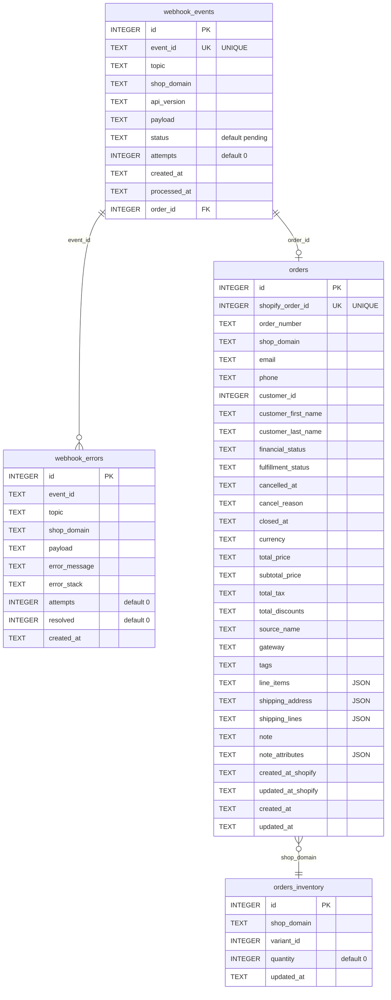

## Shopify Webhook Request Flow
1. Receive — POST /webhooks/shopify with raw() middleware to preserve the original bytes for HMAC verification.
2. Authenticate — HMAC-SHA256 computed against SHOPIFY_WEBHOOK_SECRET, compared with timingSafeEqual to prevent timing attacks. Shop domain must match config.
3. Store first, process later — Event is written to SQLite (INSERT OR IGNORE on event_id) before anything is enqueued. This guarantees no data loss even if the queue is down.
4. Enqueue — BullMQ job with deterministic jobId (webhook:{eventId}). Duplicate jobs that are already active/completed are skipped; delayed/waiting ones are replaced. Jobs are delayed and prioritized based on X-Shopify-Triggered-At for chronological processing.
5. Process — Worker (concurrency 5) routes by topic:
  - orders/create — inserts order + deducts inventory in a single SQLite transaction.
  - orders/updated — marks processed if order exists; skips otherwise (deferred to reconciliation).
6. Unknown topics — marked processed to avoid infinite retries.
7. All inserts use ON CONFLICT DO NOTHING for idempotency.
8. Retry — 5 attempts, exponential backoff (2s base). On final failure: error persisted to webhook_errors, event marked failed, job retained in queue.
9. Reconciliation — Separate scheduled job (default every 15 min, concurrency 1) fetches failed order events, re-fetches the order from Shopify's Admin API, and re-attempts insertion. Its own failures are also tracked in webhook_errors.

## Database Schema

## Product Suggestion Logic for Frontend Shopping Cart
### Point system to suggest product to customers
- Gap calculation: threshold - cartSubtotal
- Filter: only availableForSale products
- Fast path: if any candidates have price > gap, pick the cheapest among them (tie-break: prefer clearance)
- Scoring (when no single product exceeds the gap):
- Base score 1-3 from scoreProduct (bought-together affinity)
  - +1 if price >= gap
  - +2 if product is on clearance list
- Tie-breaking: score 1 -> cheapest price; score >= 2 -> highest margin

## Critical Test Cases before Production
1. Idempotency: Make sure webhook requests with same event ID are ignored. When writing to database, also verify conflicts are ignored.
2. Webhook job workers should run without failure. Reconciliation should automatically trigger at set interval.
3. Frontend shopping cart should suggest proucts frequently bought together when available, and suggest the product with the closest price to current gap to encourage customers to reach free shipping amount.